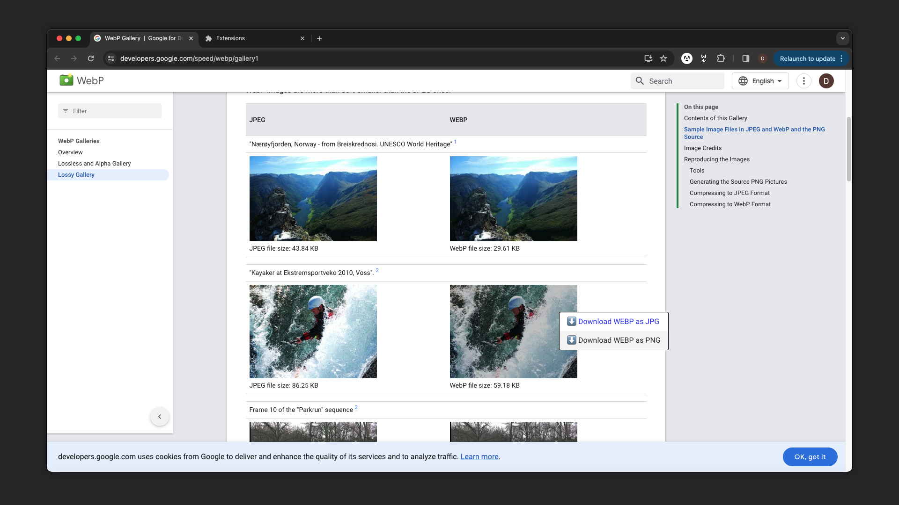

YOU AGREE THAT THE SOFTWARE IS PROVIDED TO YOU ENTIRELY FOR USE AT YOUR OWN RISK

Simple Chrome browser extension to convert and download WEBP images as JPG or PNG. When installed and enabled right click on WEBP image and pick JPG or PNG to save image. 

You can still save WEBP if you disable conversion clicking on extension icon and clicking item shown working as a toggle to disable enable extension functionality without a need to disable extension, reload etc.

There may be situations where extension will not handle the job correctly for various reasons. Disable conversion download WEBP and convert it using other solutions.

The extension is provided as source files or zip file, that just contain those files and is provided only for convenience. IT IS NOT provided via Chrome Extensions store, at least for now.

Notes:

- Extension execute all the code on user's computer, NOTHING is send anywhere for some processing etc.
- Extension DOES NOT collect and / or track any user activity
- Extension WAS NOT extensively tested, however the only thing it does it watch for right-click on WEBP images and replace browser's context menu with its 2 options converting on-the-fly and downloading image as JPG or PNG.

Installation:

1. Click Extensions icon in Chrome top bar.
2. Click "Manage Extensions".
3. Enable "Developer Mode" in top-right corner.
4. Pick directory with downloaded files / unpacked zip.
5. Check it in action e.g. on that Google owned website with some WEBP images: https://developers.google.com/speed/webp/gallery1